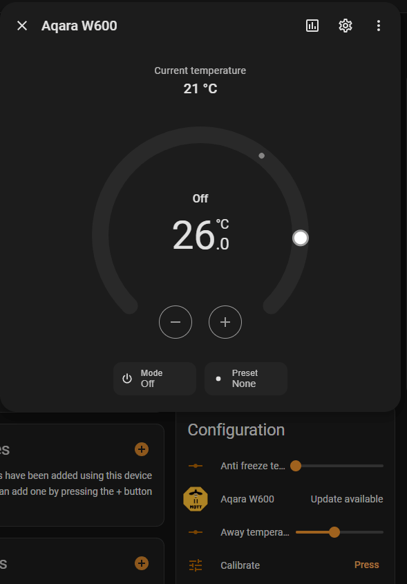

# Aqara W600 Z2M External Converter

A still work in progress Aqara W600 support implementation in zigbee2mqtt.
Repo is to share the current work status with broader audience for testing.
Last step will be a PR to the herdsman-converters repo for native Z2M support.

## PRs to the **zigbee-herdsman-converters** repo
| Feature | Modification against external converter | Link |
| --- | --- | --- |
| External Temperature Support | Dropped External Sensor IEEE Address setting - I find it useless. Implementation uses a fixed arbitrary address.| https://github.com/Koenkk/zigbee-herdsman-converters/pull/11987 |
| Thermostat Update | Do not enable heat when preset is changed while OFF. | https://github.com/Koenkk/zigbee-herdsman-converters/pull/11991 |

## Implemented features

| Feature | Status | Description/notes |
| --- | --- | --- |
| Thermostat (climate) | Full | Full set of presets (`home`, `away`, `vacation`, `sleep`, `wind_down`). Fully functional `Auto` mode - see **Schedule Management**.|
| Preset configuration | Full | Every preset temperature can be configured via dedicated entity |
| Schedule management | Full | Complete implementation of the scheduling system and its configuration. Dedicated entities to set schedule for each day. Manual override handling and its timeout configuration. W600 specific time synchronization.|
| External Temperature Source | Full | Possibility to switch to external temp sensor readings. It is using a `number` entity to provide temperature readings. Requires Home Assistant automation, but you can use just anything as source. |
| Open Window Detection | Almost full | Ability to enable open window detection. It is possible to choose the detection method: `temperature_difference` or `external sensor`. External sensor state requires Home Assistant automation to update `select` entity state. External sensor support is fully implemented. Temp difference indication works for sure if no other errors are signaled. Might not work if there are multiple error flags on the TRV - to be verified. |
| Battery status Indicator | Full | Shows current percentage of installed batteries. |
| Anti-Freeze Temperature | Full | Entity to configure the Anti-Freeze Temperature. |
| Temperature control abnormal notification | Partial | Two entities: one to enable/disable reporting temperature control problem. Second one is exposed as "problem" entity. The bit responsible for reporting the detected problem is **probably** identified, but as with the Open Window Detection using temp difference - it might not always work in case multiple problem flags adds up. To be verified. |
| Temperature Compensation | was already | Dedicated entity defining the desired delta. |
| Valve Calibration | was already | Status of the valve calibration. |
| Valve Position | was already | Percentage of the valve opening position. |
| Display Flip | was already | Flip display orientation. |
| Child Lock | was already | Disable physical control of the TRV. |
| Regular OTA | was already | Over the Air updates. |
| Identify | was already | Turns on display in the TRV. |

## Entities in Home Assistant
| Entity name | Type | Description |
| --- | --- | --- |
| Climate | `climate` | Standard climate entity with 3 modes: `off`, `heat` and `auto`. 6 presets are available: `home`, `away`, `sleep`, `vacation`, `wind_down`. |
| Calibration status | `sensor` | Current valve calibration status. Can be `not_ready`, `ready`, `error` or `in_progress`. |
| Temperature | `sensor` | Temperature reported by the TRV. If external temp sensor is enabled it will report the ext sensor reading it received. |
| Valve position | `sensor` | Opening position of the valve - 100% means fully open |
| Anti freeze temperature | `number` | Set a temperature under which the valve will open even if set to off to prevent watere freezing. |
| Away temperature | `number` | Temperature setpoint for `away` preset. |
| Calibrate | `button` | Press to start valve calibration. |
| Child lock | `switch` | Disable buttons (manual control)  on the device. |
| Clear schedule | `button` | Press to clear saved schedule on the TRV. |
| Display flip | `switch` | Change display orientation by 180° |
| External Temperature Sensor IEEE Address | `text` | Type here a zigbee IEEE address if you want to use external temp sensor readings as temp source on the TRV. Does not have to be an address of a real device, but must me a valid address. |
| External Window Sensor IEEE Address | `text` | Type here a zigbee IEEE address if you want to use external window opening sensor readings. Does not have to be an address of a real device, but must me a valid address. |
| External Window Sensor State | `select` | If external window sensor readings are used, updating this entity will send update to the TRV bout window status (`open`/`closed`). Will send periodic update to the TRV even if entity state is not changed. |
| `Day` schedule | `text` | Trigger-based schedule for a given day. Format: `hh:mm/preset`, for example: `08:00/home`. Separate multiple triggers by comma, e.g. `00:00/sleep, 08:00/away, 16:00/home, 23:00/sleep`. |
| Home temperature | `number` |  Temperature setpoint for `home` preset. |
| Identify | `button` | Turn on display on the TRV for a moment to identify the device. |
| Manual override | `switch` | If TRV mode is set to `auto` and you change temperature setpoint, this entity will change to `ON`. Override will automatically expire after time defined in **Manual Override Duration** entity. |
| Manual Override Duration | `number` | Time in minutes of how long the manual override last. Special values: `0` means until next schedule triggere, `65535` means to never expire. |
| Save scheudle | `button` | Press to save schedule on the TRV (upload schedule data) |
| Sleep temperature | `number` | Temperature setpoint for `sleep` preset. |
| Temperature | `number` | External temperature sensor reading to be sent to TRV when external temperature sensor is enabled. |
| Temperature control abnormal notification | `switch` | Alert if there's a significant temperature difference between room and setpoint temperature for an extended period of time. Alert should be visible in **Problem** sensor being triggered. |
| Temperature delta | `number` | Temperature reading correction. |
| Temperature source | `select` | Select temperature reading source. Can be `internal` or `external`. If you want to set `external`, **External Temperature Sensor IEEE Address** and **Temperature** of the external sensor reading must be set upfront. |
| Vacation temperature | `number` | Temperature setpoint for `vacation` preset. |
| Weekly schedule | `switch` | Enable or disable functionality of the weekly schedule on TRV. |
| Wind-down temperature | `number` | Temperature setpoint for `wind_down` preset. |
| Window detection | `switch` | Enable or disable open window detection functionality on teh TRV. |
| Window detection mode | `select` | Choose betwen `temperature_difference` and `external_sensor` to detect opened window. If you want to select `external_sensor` you must first set the **External Window Sensor IEEE Address**. |
| Battery | `sensor` | Percentage battery indicator. |
| Error status bytecode | `sensor` | Value for debugging the error reporting flags. |
| Last error status update | `sensor` | Timestamp coming with error reporting flags. |
| Problem | `binary_sensor` | TRV problem indicator based on "temperature abnormal' error flag. |
| Schedule upload status | `sensor` | Sensor showing the status of schedule upload. Once you hit **Save schedule**, it is being compiled and uploaded to the TRV. |
| Voltage | `sensor` | **Most likely** battery voltage. Not updated frequently as per my observations. |
| Window | `sensor` | Open Window detection status providedc by the TRV. |

## Identified problems
1. Template erros in Home Assistant error log when onboarding or removing a TRV.
